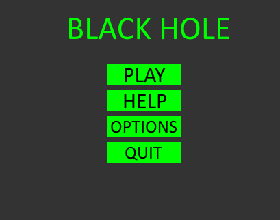
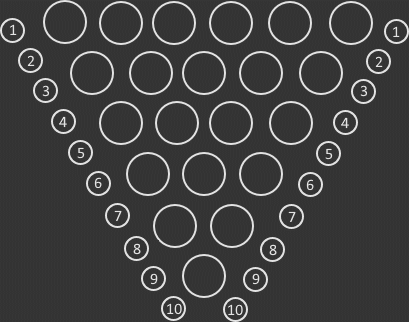
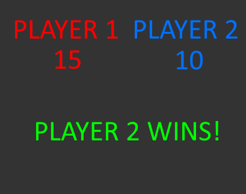

# Black Hole
## Game Design Pitch
Black Hole is a simple board game with both players having numbers ranging from 1-10, the aim of the game is to fill 20/21 cells with both players' tokens while ensuring your tokens are the least exposed at the end. After all tokens are placed, there will be one cell left unfilled, this cell is the 'black hole' and any cells adjacent to it will be summed for each player, whoever has the least score wins the round.

## Concept statement  
Black Hole gives a fast but competitive game for 2 friends to play while bored on a road trip or stuck at a family dinner with nothing to do!

## Target audience  
Black Hole has a quick play style catered towards anyone who doesn't have a lot of time to sit down and play a more in depth game. It's a fast paced strategy game with fun and vibrant graphics. The concept is simple to understand but has a large ability to be majorly expanded upon to create a much more strategy based experience. The game is suitable for anyone 10+.

## Reference
Black Hole is a simple board game and I will be creating the digital version of this. The concept of the game will be identical to black hole but VFX and SFX will be used to enhance the experience.

## Player experience and game POV
The game aims to create a competitive but fun experience for both players. The players will experience a phase where they aren't sure on strategies when they first start playing, although after time, they will learn how to interact and compete against other players.

## Unique Selling Points
The VFX will help the game stand out from the board game itself, and it will eventually support online gameplay, allowing friends to play together online (this is a stretch goal). This game also does not exist as a digital game yet for online or single player gameplay.

## Genre
2 Player Turn Based Strategy Board Game similar to Othello and Chess.

## Platform(s) and primary technology
- PC, web and mobile
- 3D
- Unity.

## Visual/audio Style
The game will have a very stylized look, aiming to make use of unity's particle system and universal render pipeline to create stunning VFX to brighten up the game world. The desired experience is a bright and exciting game to help the players enjoy the game a lot more when competing against friends and family.

## Game Systems
### Game State
A game state checker is a necessary component of the game, this will check the game for when it has been completed as well as give the respective scores to each player. These scores will then be compared and whoever has the lowest score wins the game.
### Interactions
Simple controls will be used to help the players interact with the game in an easy and understandable way. When it is a players turn, available cells will light up and the player's next token is already selected, all the player has to do is click/press on a cell for the token to be placed, after this the player can confirm their move with a button at the bottom of the screen.
### Turn-Based System
The game works on a turn based system where after every turn made, the current player switches to the next player.

## Interactivity
Two players are given a board on which they can place 10 tokens linearly onto the board consisting of 21 cells. The players try to strategize against the other player to set up a scenario where they have the lowest sum at the end of the game.

## Game UI:
#### Menu Screen

#### Game Screen

#### Win Screen

